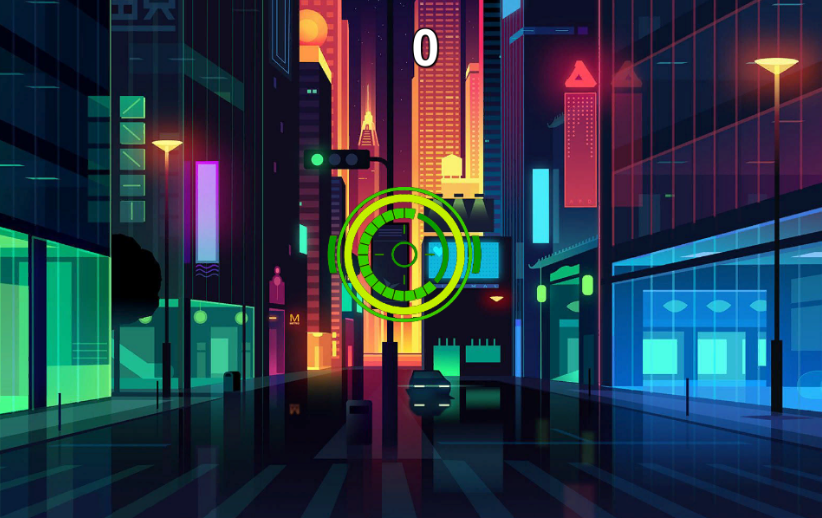

# Recap-nima

### Project description:

* This project consists of a basic 2D shooting game in which at least 10 targets have to be shot down to win.
To make everything harder, the targets respawn every 2 seconds. Moreover sound effects and a sprite in the form of a crosshair are added in order to make the game more lively.

### Development platform:

* Windows 10
* Unity 2020.3.18f1
* Visual Studio 2019

### Target platform:

* 2D WebGL (960 x 600)

### Visuals:

### Necessary setup/execution steps: 

* WebGL-Link: 

### Third party material:

* Sounds: https://freesound.org
* Background: https://wallpaperaccess.com/futuristic-minimalistic
* Target: https://www.vecteezy.com/vector-art/146198-circle-hud-futuristic-vector
* Crosshair: https://pixabay.com/de/vectors/fadenkreuz-anvisieren-zielen-467258/?download

### Project state:

* 50 %

### Limitations: 

* none

### Lessons Learned:

* revision of basic c# structure
* revision of further c# functions

	

Copyright by nima